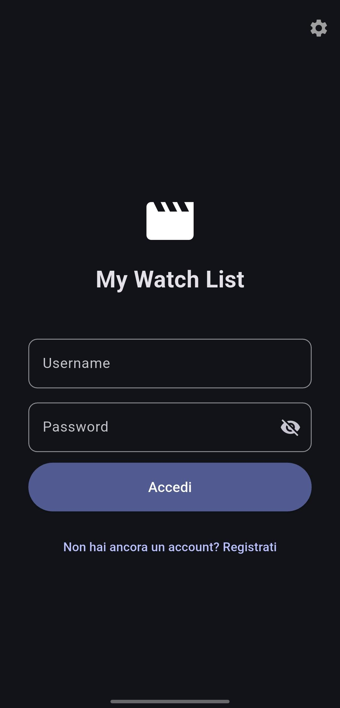
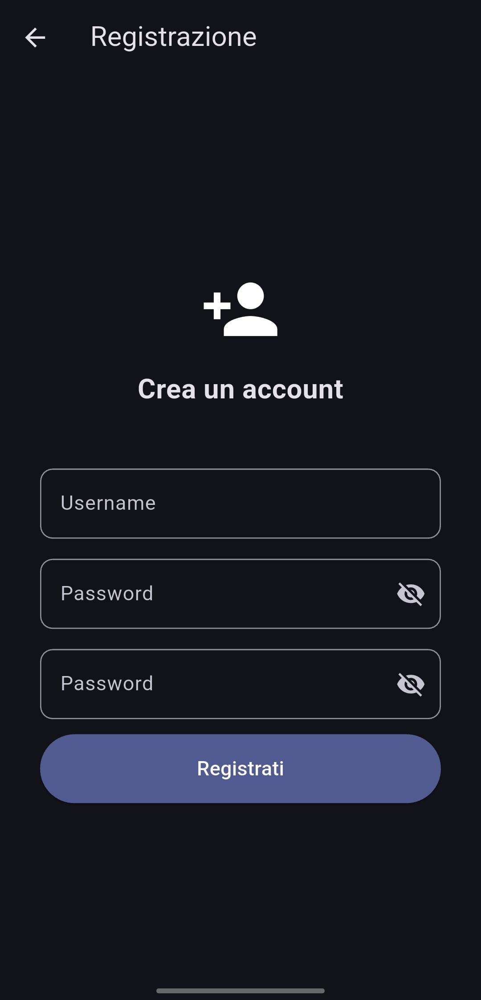
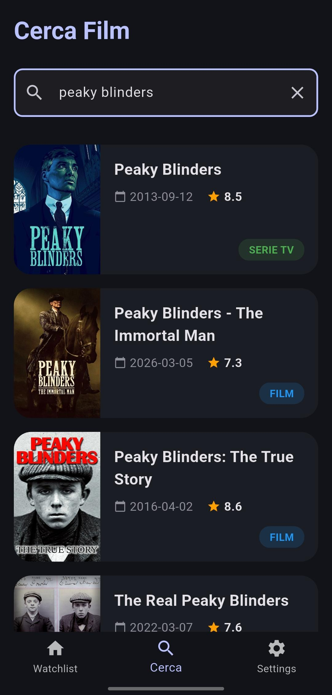
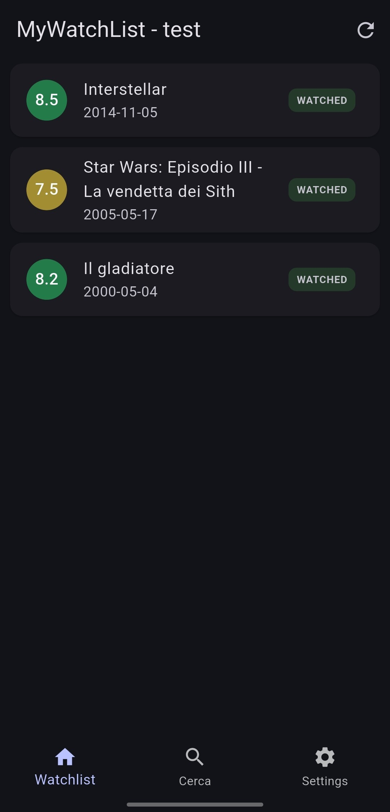
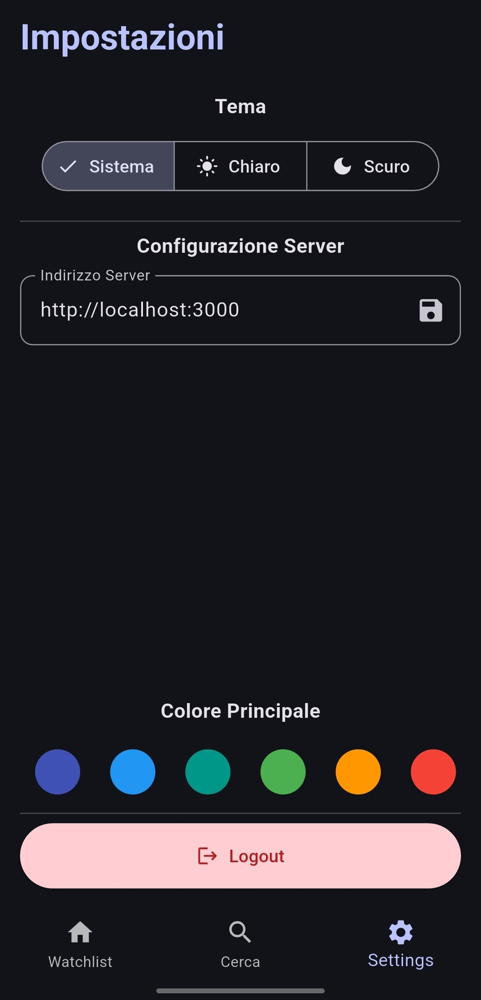
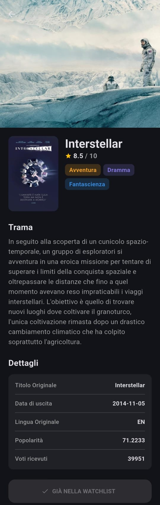
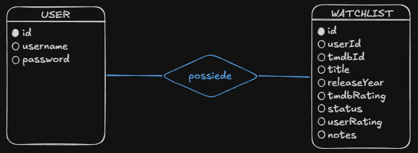

# my_watch_list

**Sviluppatore:** Giuseppe Maugeri
**Classe:** 5ID

## Descrizione

MyWatchList è un'applicazione realizzata in **Flutter** che consente agli utenti di ricercare i propri film e di aggiungerli alla propria lista di guardati o da guardare. Il progetto utilizza un backend mock basato su **json-server** per simulare operazioni RESTful reali e integra **SQLite** per la cache locale.

---

## Showcase

<table>
  <tr>
    <td align="center"><b>Login</b></td>
    <td align="center"><b>Registrazione</b></td>
    <td align="center"><b>Ricerca</b></td>
    <td align="center"><b>Watchlist</b></td>
    <td align="center"><b>Impostazioni</b></td>
    <td align="center"><b>Dettaglio Film</b></td>
  </tr>
  <tr>
    <td></td>
    <td></td>
    <td></td>
    <td></td>
    <td></td>
    <td></td>
  </tr>
</table>

---

## Diagramma E-R



---

## Struttura del progetto

### SERVER REST

Il database è gestito tramite `json-server`. Contiene due risorse principali:

- `users`: contiene le informazioni degli utenti registrati;
- `watchlist`: contiene gli elementi salvati dagli utenti.

```json
{
  "users": [
    {
      "id": 1,
      "username": "esempio",
      "password": "hashed_password_with_bcrypt"
    }
  ],
  "watchlist": [
    {
      "id": 1,
      "user_id": 1,
      "tmdb_id": 12345,
      "title": "Interstellar",
      "release_date": "2014-04-12",
      "tmdb_rating": 8.7,
      "status": "to_watch",
      "user_rating": 8,
      "notes": "Bel film"
    }
  ]
}
```

## CLIENT FLUTTER

```text
my_watch_list/
├── assets/
│   └── images
│       └── icona.png
├── backend/
│   └── db.json
├── bin/
│   └── test.dart
├── lib/
│   ├── database/
│   │   ├── database_helper.dart
│   ├── models/
│   │   ├── movie.dart
│   │   ├── user.dart
│   │   └── watchlist.dart
│   ├── providers/
│   │   ├── settings_provider.dart
│   │   ├── user_provider.dart
│   │   └── watchlist_provider.dart
│   ├── screens/
│   │   ├── homepage
│   │   │   ├── navigation_screen.dart
│   │   │   ├── search_movie_details_screen.dart
│   │   │   ├── search_screen.dart
│   │   │   └── settings_screen.dart
│   │   ├── watchlist/
│   │   │   ├── watchlist_details_screen.dart
│   │   │   └── watchlist_list_screen.dart
│   │   ├── login_screen.dart
│   │   ├── register_screen.dart
│   │   └── splash_screen.dart
│   ├── services/
│   │   ├── api_service.dart
│   │   └── tmdb_service.dart
│   ├── widgets/
│   │   └── widgets.dart
│   └── main.dart
├── pubspec.yaml
└── README.md
```

---

## Endpoint API

### Users

| Metodo | Endpoint                     | Descrizione                   |
| ------ | ---------------------------- | ----------------------------- |
| GET    | `/users`                     | Lista utenti                  |
| GET    | `/users?username={username}` | Verifica esistenza utente     |
| GET    | `/users/{id}`                | Recupero dettagli utente      |
| POST   | `/users`                     | Registrazione nuovo utente    |
| PUT    | `/users/{id}`                | Aggiornamento completo utente |
| PATCH  | `/users/{id}`                | Aggiornamento parziale utente |
| DELETE | `/users/{id}`                | Rimozione utente              |

### Watchlist

| Metodo | Endpoint                      | Descrizione                              |
| ------ | ----------------------------- | ---------------------------------------- |
| GET    | `/watchlist`                  | Lista watchlist                          |
| GET    | `/watchlist?user_id={userId}` | Lista watchlist per uno specifico utente |
| POST   | `/watchlist`                  | Aggiunta di un nuovo elemento alla lista |
| PUT    | `/watchlist/{id}`             | Aggiornamento completo elemento          |
| PATCH  | `/watchlist/{id}`             | Aggiornamento parziale                   |
| DELETE | `/watchlist/{id}`             | Rimozione elemento dalla lista           |

---

## Dipendenze Flutter (`pubspec.yaml`):

Le principali librerie utilizzate nel progetto sono:

- **provider**: Gestione dello stato.
- **http**: Comunicazione con il backend REST API.
- **bcrypt**: Hashing e verifica delle password per la sicurezza.
- **shared_preferences**: Persistenza locale dei dati di sessione.
- **sqflite**: Database locale per supporto offline e cache.

---

## Diario di progetto

### Step 1 - Fase Preliminare

Prima di iniziare ho ricercato una buona api (esterna) da poter utilizzare per il mio progetto. Tra le tante la migliore che ho trovato è stata quella di [TMDB](https://developer.themoviedb.org/docs/getting-started), offriva una buona documentazione e un buon database tutto gratuitamente. Per ottenere la chiave api (API key) bastava effettuare una registrazione e richiederne una. Per testare l'api ho consulatato la documentazione, i vari endpoint disponibili e ciò che restiuivano.

### Step 2 - Scelta dei modelli

Per continuare ho stabilito le entità che avrei utilizzato nel db esterno (ovvero le mie api), una volta scelte le entità ho realizzato i modelli in dart. Successivamente ho realizzato le operazioni CRUD all'interno di `api_service.dart` e le ho testate in `bin/test.dart`, per testarle ho utilizzato json-server. Per quanto riguarda la chiamata delle api esterne di tmdb, ho realizzato i metodi che mi servivano all'interno di `tmdb_service.dart`.

### Step 3 - Utilizzo di Provider

Continuando con lo sviluppo delle varie pagine della mia applicazione ho avuto bisogno di centralizzare lo stato di alcune mie variabili attraverso alcuni provider. Ho scelto di utilizzare un MultiProvider, ovvero più provider, poichè l'utilizzo di un solo provider che racchiudeva tutto sarebbe stato eccessivo, e volevo mantenere una pulitezza e chiarezza del codice.

### Step 4 - Schermate UI

Continuando col progetto ho sviluppato anche la maggior parte delle schermate che mi serviva, utilizzando uno stile non troppo complicato ma moderno e pulito.

### Step 5 - Database locale

Per concludere, ho implementato un database locale tramite SQLite, utilizzato come cache nel caso in cui la connessione al server o alla rete non sia possibile.

### Step 6 - Fase di debug

Infine nella fase di debug ho controllato che tutto andasse alla perfezione.

---

## Fonti

Principalmente ho utilizzato la documentazione ufficiale di TMDB per quanto riguarda le api esterne.
Per quanto riguarda invece il resto del progetto ho utilizzato soprattutto la documentazione ufficiale di Flutter e di Dart, tuttavia ho anche consultato qualche sito web preso un po di qua e di là, oppure utilizzato qualche IA per risolvere appositi problemi o per prendere spunto riguardo all'estetica.
